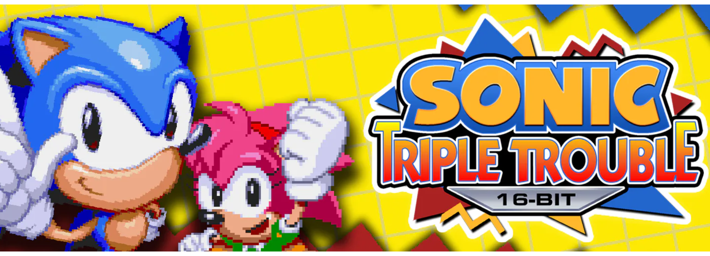

<div align=center>



</div>
<h1 align=center>Don't Forget (DF Connected) Switch Port</h1>

This is a wrapper/port of the Android version of *Don't Forget* (*DF Connected*). It loads the original game's GameMaker Studio 2 runner and runs it natively on the Nintendo Switch: the original Android ARM64 `libyoyo.so` is loaded directly into an emulated Android environment, the same technique used by other ports in this family (Vita3K-style `.so` loaders).

### ⚠️ Before you start: check your APK has a 64-bit build

This loader only supports **64-bit ARM (`arm64-v8a`)** native libraries — it maps and executes `libyoyo.so` directly as AArch64 machine code on the Switch's CPU, with no emulation layer for other instruction sets.

Some `DF Connected` builds (particularly older direct-download `.apk`s from itch.io/Game Jolt rather than the Play Store) only ship `armeabi`, `armeabi-v7a` (32-bit ARM), `mips`, and `x86` versions of `libyoyo.so` — **no `arm64-v8a` folder at all**. If you check your APK's `lib/` folder and only see those four directories, **this specific file cannot be used** to power the port; you'll need to track down a build of the game that includes `lib/arm64-v8a/libyoyo.so`. Unzip the `.apk` (it's a standard zip) and look for:

```
lib/
├── arm64-v8a/   <-- you need this one
├── armeabi/
├── armeabi-v7a/
├── mips/
└── x86/
```

If `arm64-v8a/` is missing, the install steps below won't get you a working game — get in touch with wherever you got the game from for a current build, or check if it's since been released on Google Play (which has required 64-bit support since 2019).

### What You Need

From a `DF Connected` `.apk` that **does** include an `arm64-v8a` build, extract:

* **`lib/arm64-v8a/libyoyo.so`** — the GameMaker Studio 2 game engine.
* **`lib/arm64-v8a/libc++_shared.so`** — the C++ runtime, *if present*. Newer GMS2 builds statically link the C++ runtime into `libyoyo.so` itself, so this file may legitimately be missing — that's fine, the port handles both cases.
* The **entire `assets/` folder** from the `.apk`. This includes (among other things):
  * `game.droid` — the compiled GameMaker project data.
  * `audiogroup*.dat` — bundled audio groups.
  * `001.dat` … `008.dat` (and `007-en.dat`) — the FMV cutscenes (H.264/AAC, XOR-obfuscated MP4s).
  * `mus_*.ogg` / `snd_*.ogg` / `vo_*.ogg` — music, sound effects, and voice lines.
  * Everything else in that folder — copy it all, don't cherry-pick.
* The **`.apk` file itself**, renamed to **`game.apk`**. The engine's `Startup()` call expects this exact filename next to the executable, even though most of what it needs has already been extracted into `assets/`.

### Setup Instructions

1. Create a folder called `dontforget_nx` inside the `switch` folder on your SD card: `sdmc:/switch/dontforget_nx/`.
2. Extract **`lib/arm64-v8a/libyoyo.so`** from your `.apk` and copy it to `sdmc:/switch/dontforget_nx/libyoyo.so`.
3. If your `.apk` has **`lib/arm64-v8a/libc++_shared.so`**, copy it to `sdmc:/switch/dontforget_nx/libc++_shared.so` too. If it's not there, skip this step.
4. Copy the **entire `assets/` folder** from your `.apk` into `sdmc:/switch/dontforget_nx/assets/`.
5. Copy the **`.apk` file itself** into `sdmc:/switch/dontforget_nx/` and rename it to **`game.apk`**.
6. Copy **`dontforget_nx.nro`** (the build output) into `sdmc:/switch/dontforget_nx/`.

Your final layout should look like this:

```
sdmc:/switch/dontforget_nx/
├── dontforget_nx.nro
├── libyoyo.so
├── libc++_shared.so        (optional — only if your APK shipped one)
├── game.apk
└── assets/
    ├── game.droid
    ├── audiogroup0.dat
    ├── audiogroup1.dat
    ├── audiogroup2.dat
    ├── 001.dat … 008.dat
    ├── mus_*.ogg
    ├── snd_*.ogg
    ├── vo_*.ogg
    └── ... (every other file from the APK's assets/ folder)
```

### Notes

* This port **will not work in applet mode** (Album). Launch it via the Homebrew Menu using a **game override** (hold **R** while launching any installed game from the Switch's home menu) so it gets full memory access and the syscalls it needs (`svcMapProcessCodeMemory`, `svcUnmapProcessCodeMemory`, `svcSetProcessMemoryPermission`).
* Save data and `config.txt` are both kept in `sdmc:/switch/dontforget_nx/` — the same folder the `.nro` runs from doubles as the writable/save directory.
* Networking (BSD sockets) is initialized at startup for the game's online/`network_*` features. If Wi-Fi isn't connected, the game will still launch — only online functionality will be unavailable.

### Configuration

`config.txt` is created on first run in `sdmc:/switch/dontforget_nx/` and supports:
* `screen_width` / `screen_height` — render resolution. Invalid or out-of-range values automatically fall back to 1280×720 in handheld mode and 1920×1080 in docked mode.
* `language` — UI language code (e.g. `en`, `de`, `fr`, `es`, `it`, `pt`, `ru`, `ja`).

### How to Build

You'll need the `devkitA64` toolchain and the following `devkitPro` portlibs:
* `switch-dev`
* `switch-sdl2`
* `switch-mesa`
* `switch-libdrm_nouveau`
* `switch-freetype`
* `switch-libpng`
* `switch-ffmpeg`

Run `make` to compile; the output is `dontforget_nx.nro`.

### Credits

* [fgsfdsfgs](https://github.com/fgsfdsfgs) for [max_nx](https://github.com/fgsfdsfgs/max_nx) and [NaGaa95](https://github.com/NaGaa95) for [ct_nx](https://github.com/NaGaa95/ct_nx), which this loader is heavily based on.
* [TheOfficialFloW](https://github.com/TheOfficialFloW) for the original Vita ports that pioneered the Android `.so` loading technique.
* The original developers of *Don't Forget* / *DF Connected* for the game itself.

### Legal

This project has no affiliation with the developers of *Don't Forget* / *DF Connected*, with YoYo Games Ltd, or with any third-party properties referenced within the game. "GameMaker Studio" is a trademark of YoYo Games Ltd.

No assets or program code from the original game are included in this repository. We do not condone piracy and encourage users to legally obtain the original game from its official source.

Unless specified otherwise, the source code provided in this repository is licensed under the MIT License. Please see the accompanying LICENSE file.
